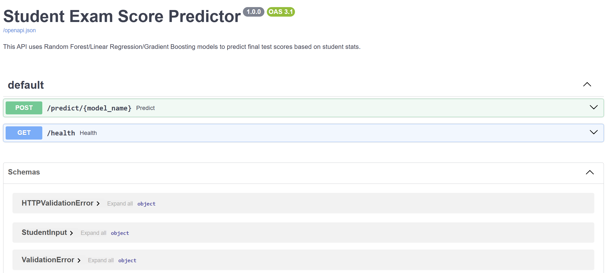
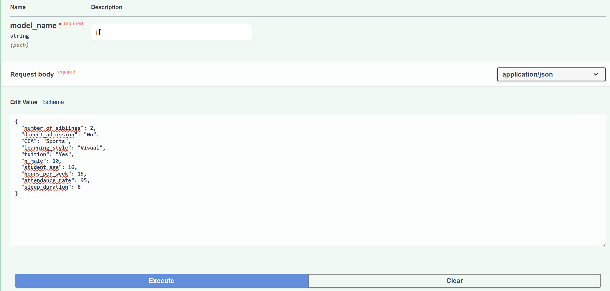
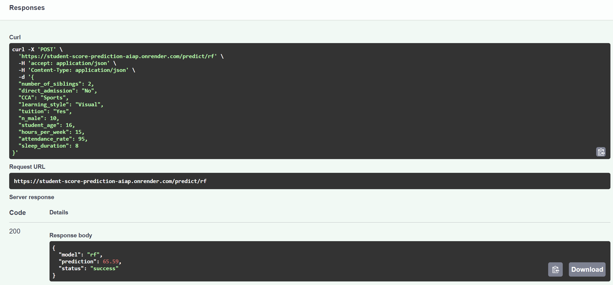

# 📊 Model Prediction & Deep-Dive Analysis
> **Document Status:** Complete | **Scope:** API Behavioral Validation & Multi-Model Comparison | **Target API:** Student Exam Score Prediction API

---

## 📌 Executive Summary

This document details the behavioral validation of the **Student Exam Score Prediction API**. We evaluated three distinct machine learning models—**Random Forest (RF)**, **Gradient Boosting (GBR)**, and **Linear Regression (LR)**—across various student profiles and stress scenarios. 

This analysis checks the models for logical consistency, evaluates performance nuances, and provides a clear recommendation for the primary production model.

---

### 📷 API Interface & Interactive Documentation

To support model validation and rapid testing, interactive endpoints were integrated using Swagger UI:

<p align="center">
  
  
  
</p>
<p align="center">
  <em>Figure 1: Swagger UI interface illustrating multi-model interactive prediction inputs and responses.</em>
</p>

---

## 1. Baseline Scenario (Standard Student)

**Scenario Description:** A typical student profile with 95% attendance, 15 hours of weekly study, and active tuition support.

### Full JSON Payload
```json
{
  "number_of_siblings": 2,
  "direct_admission": "No",
  "CCA": "Sports",
  "learning_style": "Visual",
  "tuition": "Yes",
  "n_male": 10,
  "student_age": 16,
  "hours_per_week": 15,
  "attendance_rate": 95,
  "sleep_duration": 8
}
```

### Model Predictions & Interpretations
| Model | Predicted Score | Interpretation |
| :--- | :---: | :--- |
| **Random Forest (RF)** | `65.59` | **Optimistic:** Likely rewards the synergistic combination of high attendance and active tuition. |
| **Gradient Boosting (GBR)** | `63.30` | **Conservative:** Standardizes prediction around the most frequent baseline patterns in the training data. |
| **Linear Regression (LR)** | `62.94` | **Linear Average:** Represents the exact mathematical average expectation for these inputs. |

> [!NOTE]
> **Key Finding — Model Consensus:**
> In the baseline test, all three models predicted scores within a narrow **2.65-point** range—well within the overall model Mean Absolute Error (MAE) of **5.83**. This high consensus indicates a strong, consistent signal in the student performance dataset. The slight upward lead of **Random Forest (RF)** suggests it is capturing positive non-linear interaction effects (e.g., the dual benefit of high attendance paired with tuition).

---

## 2. Stress Test: Attendance Sensitivity

**Scenario Description:** An extreme stress test where the student's attendance rate is dropped from **95% → 10%** to verify model sensitivity and fallback logic.

### Full JSON Payload
```json
{
  "number_of_siblings": 2,
  "direct_admission": "No",
  "CCA": "Sports",
  "learning_style": "Visual",
  "tuition": "Yes",
  "n_male": 10,
  "student_age": 16,
  "hours_per_week": 15,
  "attendance_rate": 10,
  "sleep_duration": 8
}
```

### Model Predictions & Impact
| Model | Predicted Score | Point Drop |
| :--- | :---: | :---: |
| **Random Forest (RF)** | `43.58` | `-22.01` |
| **Gradient Boosting (GBR)** | `46.13` | `-17.17` |
| **Linear Regression (LR)** | `34.58` | `-28.36` |

> [!WARNING]
> **Key Finding — The Impact of Presence:**
> This stress test confirms **attendance rate** as a critical predictor, aligning perfectly with its top-3 feature importance ranking in exploratory analysis.
> 
> * **Linear Regression (LR)** applies the most severe penalty (**-28.36**). Because LR operates on a strict linear assumption, it deducts a constant value for every percentage point drop in attendance, resulting in an aggressive and potentially unrealistic drop.
> * **Gradient Boosting (GBR)** is the most "forgiving", retaining a score of **46.13** (**-17.17** drop). It likely models a non-linear floor, assuming that 15 hours of weekly study still provides a base academic performance despite low attendance.
> * **Random Forest (RF)** sits balanced in the middle, predicting a score of **43.58** (**-22.01** drop). It successfully identifies a clear fail state while reasonably weighing other positive attributes (study hours, tuition, etc.).

---

## 3. Support Analysis: The "Tuition Premium"

**Scenario Description:** A control comparison isolating the impact of academic support by toggling the `tuition` attribute from `Yes` to `No` on the baseline profile.

### Full JSON Payload (Tuition: No)
```json
{
  "number_of_siblings": 2,
  "direct_admission": "No",
  "CCA": "Sports",
  "learning_style": "Visual",
  "tuition": "No",
  "n_male": 10,
  "student_age": 16,
  "hours_per_week": 15,
  "attendance_rate": 95,
  "sleep_duration": 8
}
```

### Model Sensitivity to Academic Support
| Model | Score (Tuition: Yes) | Score (Tuition: No) | Net Impact |
| :--- | :---: | :---: | :---: |
| **Random Forest (RF)** | `65.59` | `58.83` | **+6.76** |
| **Linear Regression (LR)** | `62.94` | `57.08` | **+5.86** |
| **Gradient Boosting (GBR)** | `63.30` | `60.96` | **+2.34** |

> [!NOTE]
> **Key Finding — Feature Weighting & Categorical Leverage:**
> * **Random Forest (RF)** attributes the highest value to tuition (**+6.76**). This highlights its ability to capture categorical patterns in the training data where students receiving tuition support consistently achieved higher overall scores.
> * **Gradient Boosting (GBR)** is significantly less sensitive to the tuition toggle (**+2.34**), indicating a heavier reliance on continuous numerical features (such as study hours and attendance) over categorical descriptors.

---

## 4. Engagement Analysis: CCA Variability

**Scenario Description:** Evaluating model responsiveness to non-academic attributes by testing three variations of Co-Curricular Activities (`Clubs`, `Sports`, or `None`).

### Full JSON Payload (Example - CCA: None)
```json
{
  "number_of_siblings": 2,
  "direct_admission": "No",
  "CCA": "None",
  "learning_style": "Visual",
  "tuition": "Yes",
  "n_male": 10,
  "student_age": 16,
  "hours_per_week": 15,
  "attendance_rate": 95,
  "sleep_duration": 8
}
```

### Model Performance Across Activities
| Model | Clubs | Sports | None |
| :--- | :---: | :---: | :---: |
| **Random Forest (RF)** | `65.55` | `65.59` | `66.01` |
| **Gradient Boosting (GBR)** | `63.30` | `63.30` | `63.30` |
| **Linear Regression (LR)** | `62.66` | `62.94` | `62.49` |

> [!TIP]
> **Key Finding — Complex Category Handling:**
> This comparison highlights crucial architectural differences in how each model processes categorical data:
> 
> * **Gradient Boosting (GBR) — Complete Invariance:** GBR predicts exactly `63.30` regardless of CCA. This indicates that the tree-building process likely pruned these features during training as low-impact "noise." While this prevents overfitting, GBR becomes completely blind to CCA engagement, reducing its utility for holistic student profiling.
> * **Random Forest (RF) — Nuanced Sensitivity:** RF predicts the highest score for **None** (`66.01`), suggesting that students without co-curricular commitments may have more uninterrupted focus for exam preparation. This aligns with feature importance analysis, where `CCA: None` ranks 5th (6.45% importance), whereas `CCA: Clubs` (0.26%) and `CCA: Sports` (0.18%) are negligible.
> * **Linear Regression (LR) — Activity Bias:** LR ranks **Sports** (`62.94`) higher than **None** (`62.49`), projecting a slight, positive linear coefficient associated with athletic participation.

---

## 5. Conclusion & Recommendation

Based on this deep-dive validation, the **Random Forest (RF) model** is recommended as the primary production model for the Student Exam Score Prediction API due to the following advantages:

* **Superior Feature Sensitivity:** Unlike GBR, which completely ignored CCA variability, Random Forest successfully captured the subtle, nuanced impacts of every input feature. This ensures the API utilizes the full context of a student's profile instead of relying solely on broad numerical averages.
* **Balanced Robustness:** While Linear Regression reacted too aggressively to low attendance (dropping to an unrealistic `34.58`), Random Forest provided a more realistic failing "floor" (`43.58`). This indicates the model correctly balances primary academic drivers with secondary support features.
* **Holistic Prediction:** The RF model's responsiveness to categorical changes (like `tuition` and `CCA`) results in a more context-sensitive prediction behavior, making it the most reliable tool for identifying both high-performing and at-risk students.